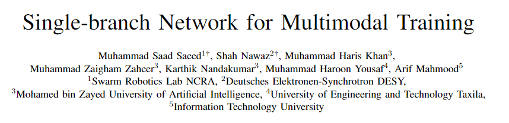
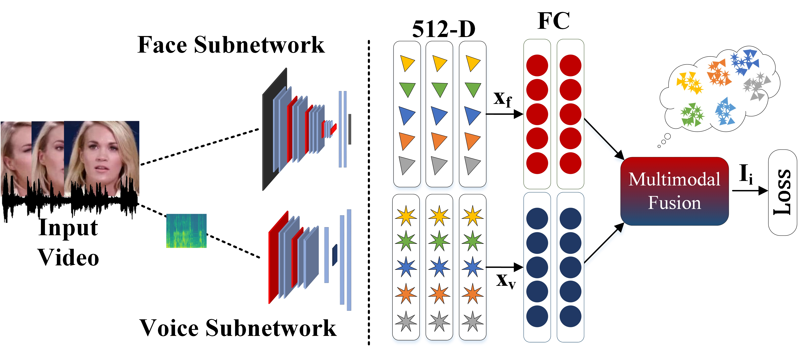
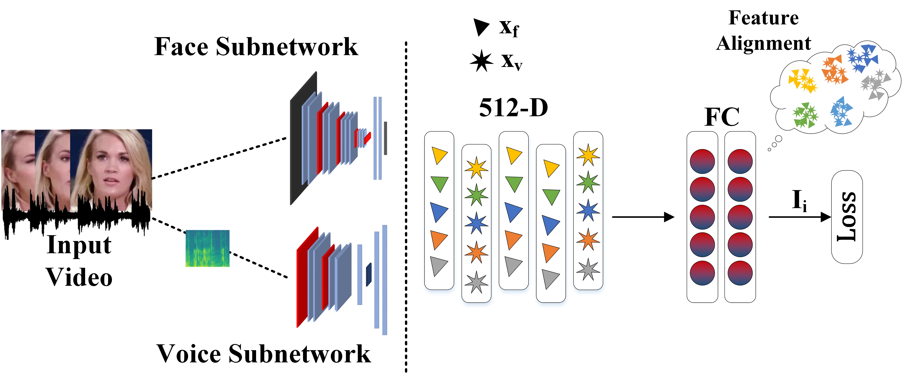

# SBNet (ICASSP 2023)

Official implementation of SBNet as described in "Single-branch Network for Multimodal Training". 

<p align="center">
  <l align="center">Paper Link: </l>  
  <a href='https://www.researchgate.net/publication/369184026_Single-branch_Network_for_Multimodal_Training' align="center">SBNet</a>
</p>
<p align="center">
  <l align="center">Presentation: https://youtu.be/bXeiy8kQQtY</l>
</p>

<p align="center">
  
</p>

## Proposed Methodology
a) Two independent modality-specific embedding networks to extract features (left) and a conventional two-branch
network (right) having two independent modality-specific branches to learn discriminative joint representations of the
multimodal task. (b) Proposed network with a single modality-invariant branch.
<p align="center"> 
  
  
 </p>


## Installation

We have used the following setup for our experiments:
```
python==3.6.5
```

[CUDA](https://developer.nvidia.com/cuda-toolkit-archive) and [cuDNN](https://developer.nvidia.com/rdp/cudnn-archive) Setup:


#### For tensorflow:

* CUDA Toolkit 10.1
* cudnn v7.6.5.32 for CUDA10.1

#### For PyTorch:
* CUDA Toolkit 10.2
* cudnn v8.2.1.32 for CUDA10.2


To install PyTorch and TensorFlow with GPU support:
```bash
  pip install tensorflow-gpu==1.13.1
  pip install torch==1.8.1+cu102 torchvision==0.9.1+cu102 torchaudio==0.8.1 -f https://download.pytorch.org/whl/torch_stable.html
```

## Feature Extraction
We perform experiments on cross-modal verification
and cross-modal matching tasks on the large-scale [VoxCeleb1
dataset.](https://www.robots.ox.ac.uk/~vgg/data/voxceleb/vox1.html)
### Facial Feature Extraction
For face feature extraction we use [Facenet](https://arxiv.org/abs/1503.03832). The official implmentation from authors is available [here](https://github.com/davidsandberg/facenet)
### Voice Feature Extraction
For Voice Embeddings we use the method described in [Utterance Level Aggregator](https://arxiv.org/abs/1902.10107). The code we used is released by authors and is publicly available [here](https://github.com/WeidiXie/VGG-Speaker-Recognition)
### Extracted Features
The face and voice features used in our work can be accessed [here](https://drive.google.com/drive/folders/1O6VaVlV6k_WM-sXqFeAkXkX9iUddVNf7?usp=sharing). Once downloaded, place the files like this:
```
|-- data
  |-- voice
    |-- .csv files
  |-- face
    |--  .csv files
|-- imgs
|-- ssnet_cent_git
|-- ssnet_fop
|-- twobranch_cent_git
|-- twobranch_fop
```

## Training and Testing
### FOP Loss
```
# Training
python main.py --save_dir ./model --batch_size 128 --max_num_epoch 100 --dim_embed 128 --split_type <face_only, voice_only, hefhev, hevhef, random, fvfv, vfvf>

# Testing
python test.py --split_type vfvf --sh unseenunheard --test random
```
### Cent/Git Loss
```
# Training
python main.py --save_dir ./model --batch_size 128 --max_num_epoch 100 --split_type <face_only, voice_only, hefhev, hevhef, random, fvfv, vfvf> --loss <git, cent>

# Testing
python test.py --split_type fvfv --sh unseenunheard --test random
```
# Baseline
For baseline results, we leverage the work from FOP.
* [Paper](https://arxiv.org/abs/2112.10483)
* [Code](https://github.com/msaadsaeed/FOP)
## Citation
```BibTeX
@inproceedings{saeed2023sbnet,
  title={Single-branch Network for Multimodal Training},
  author={Saeed, Muhammad Saad and Nawaz, Shah and Yousaf and Khan, Muhammad Haris and Zaheer, Muhammad Zaigham and Nandakumar, Karthik and Yousaf, Muhammad Haroon and Mahmood, Arf},
  booktitle={ICASSP 2023-2023 IEEE International Conference on Acoustics, Speech and Signal Processing (ICASSP)},
  year={2023},
  organization={IEEE}
}

@inproceedings{saeed2022fusion,
  title={Fusion and Orthogonal Projection for Improved Face-Voice Association},
  author={Saeed, Muhammad Saad and Khan, Muhammad Haris and Nawaz, Shah and Yousaf, Muhammad Haroon and Del Bue, Alessio},
  booktitle={ICASSP 2022-2022 IEEE International Conference on Acoustics, Speech and Signal Processing (ICASSP)},
  pages={7057--7061},
  year={2022},
  organization={IEEE}
}

